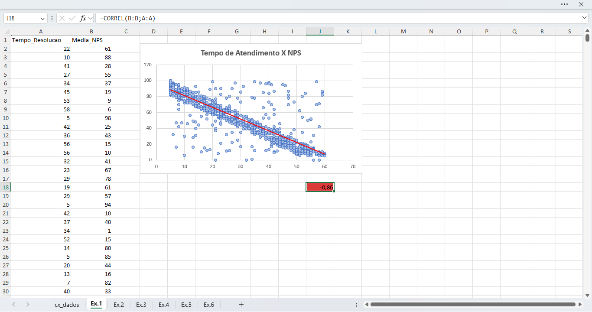
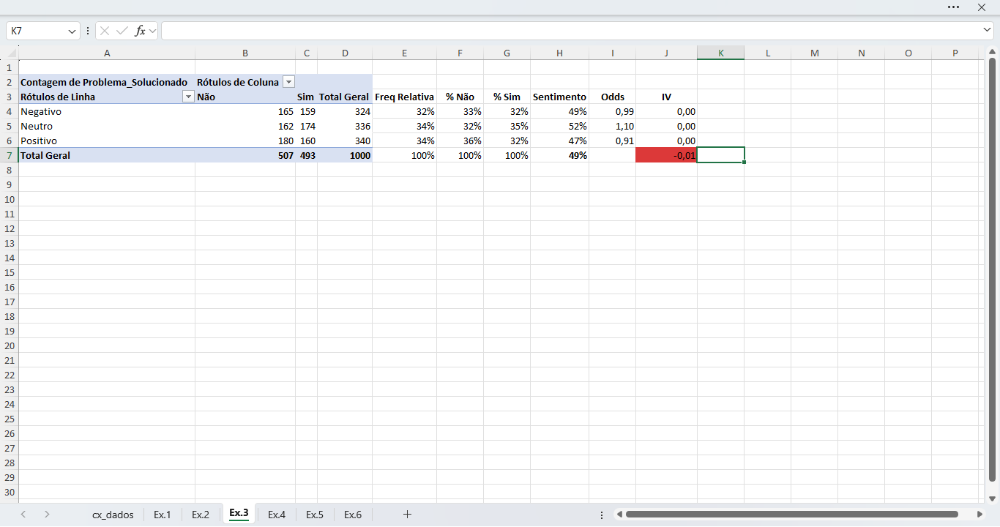
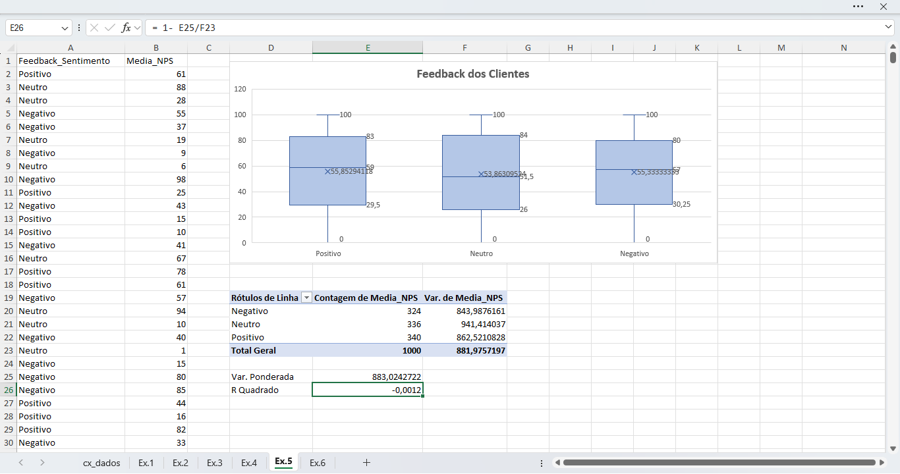

# 📊 Projeto Excel - Análise de Atendimento

## 📌 Descrição
Este projeto contém um ficheiro Excel para análise de atendimentos.

## 📁 Ficheiros
- area de atendimento.xlsx

## 🚀 Como usar
Abrir o ficheiro no Microsoft Excel e atualizar os dados na folha "cx_dados".

## 🛠️ Tecnologias
- Microsoft Excel

## 👤 Autor
André Lucas

## 📊 Correlação entre NPS e Tempo de Resolução

A correlação mede a força e a direção da relação linear entre duas variáveis.
O coeficiente varia entre -1 e +1:

+1 → Correlação positiva perfeita

0 → Sem relação linear

-1 → Correlação negativa perfeita

Quanto mais próximo de ±1, mais forte é a relação entre as variáveis.

## 📊 Análise de IV (Information Value)

O IV (Information Value) mede o poder preditivo de uma variável em modelos estatísticos, muito usado em credit scoring.

Interpretação comum:

< 0.02 → Sem poder preditivo

0.02 – 0.1 → Fraco

0.1 – 0.3 → Médio

0.3 – 0.5 → Forte

> 0.5 → Muito forte (pode indicar sobreajuste)

Quanto maior o IV, maior a capacidade da variável distinguir entre classes.

## 📊 Análise de Coeficiente de Determinação (R²)

O R² indica a percentagem da variabilidade da variável dependente explicada pelo modelo.

Varia entre 0 e 1:

0 → O modelo não explica a variação

1 → O modelo explica totalmente os dados

Exemplo:
Um R² = 0.75 significa que 75% da variação é explicada pelo modelo.

